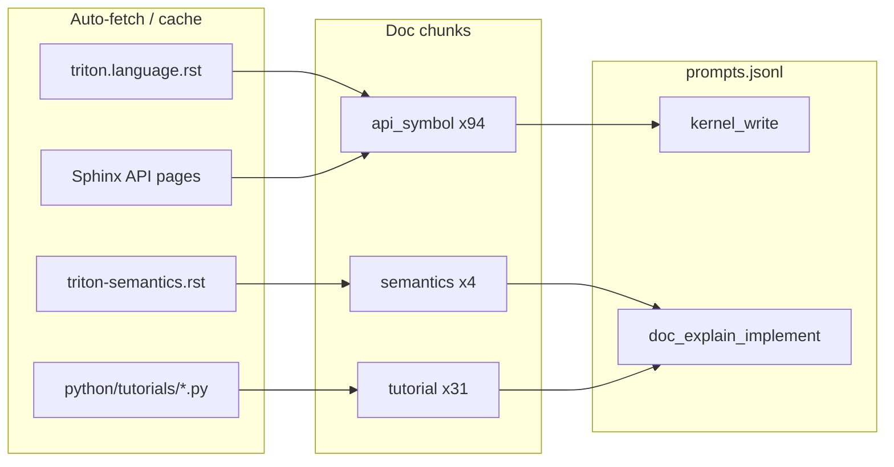

# Doc chunk prompt generation

SparkProof **Source A** turns official [Triton documentation](https://github.com/triton-lang/triton/tree/main/docs) into training prompts for teacher distillation. Each doc chunk becomes one seed row in `prompts.jsonl`; teachers generate kernels from those seeds; Blackwell prove keeps only passing trajectories for SFT.

This is **not** raw-doc pretraining. Qwen learns from **teacher responses** on doc-grounded tasks, not by ingesting RST/HTML directly.

## Overview



**Default full doc run:** **129 prompts** (94 + 4 + 31).

| Build source | Chunk kind | Prompts | Category | Task style |
|--------------|------------|---------|----------|------------|
| `api_doc` | `api_symbol` | ~94 | `kernel_write` | Write kernel that **must use** `tl.{symbol}` |
| `doc_semantics` | `semantics` | ~4 | `doc_explain_implement` | Explain doc + implement demo kernel |
| `doc_tutorial` | `tutorial` | ~31 | `doc_explain_implement` | Explain tutorial section + implement kernel |

## Modules

| File | Role |
|------|------|
| [`sparkproof/triton_dataset/doc_chunks.py`](../sparkproof/triton_dataset/doc_chunks.py) | Fetch/cache docs, parse RST/tutorials, build chunk dicts |
| [`sparkproof/triton_dataset/doc_api_pages.py`](../sparkproof/triton_dataset/doc_api_pages.py) | **Option B** — enrich API symbols from Sphinx-generated pages |
| [`sparkproof/triton_dataset/prompt_filters.py`](../sparkproof/triton_dataset/prompt_filters.py) | `--source` / `--task-id` filtering |
| [`sparkproof/triton_dataset/build_prompts.py`](../sparkproof/triton_dataset/build_prompts.py) | Merge doc chunks with mutation/torch_op sources |
| [`scripts/run_doc_qwen.sh`](../scripts/run_doc_qwen.sh) | One-shot: doc prompts → generate → verify → SFT → optional train |

## Quick start

### Build all doc prompts

```bash
cd SparkProof

# Auto-fetches from GitHub v3.7.1 on first run; caches locally
uv run sparkproof-build-prompts \
  --out prompts/doc_full.jsonl \
  --sources api_doc,doc_semantics,doc_tutorial
```

### Doc-only pipeline → SFT → Qwen

```bash
scripts/run_doc_qwen.sh --run-id doc-full-001
scripts/run_doc_qwen.sh --run-id doc-full-001 --train   # + Axolotl SFT (needs SparkDistill)
```

### Smoke test (2 prompts)

```bash
scripts/run_doc_qwen.sh --limit 2
```

## How chunks are built

### 1. API symbols (`api_doc`)

**Input:** [`docs/python-api/triton.language.rst`](https://github.com/triton-lang/triton/blob/main/docs/python-api/triton.language.rst) — Sphinx `autosummary` index listing every `triton.language` symbol.

**Parser:** `parse_triton_language_rst()` — one chunk per symbol with `target_api=tl.{symbol}`.

**Option B enrichment** (`doc_api_pages.py`):

1. Local Sphinx build: `docs/python-api/generated/triton.language.{symbol}.rst`
2. Cache: `~/.cache/sparkproof/triton-docs/v3.7.1/api-pages-pinned/{symbol}.txt`
3. Optional version-pinned HTML mirror configured through `SPARKPROOF_TRITON_API_PAGE_BASE`

Enriched prompts include signatures, parameters, and notes (up to 4000 chars of context).
SparkProof does not implicitly fetch `triton-lang.org/main`, because that moving source
cannot provide a reproducible Triton 3.7.1 dataset.

**Example prompt shape:**

```
Write a complete Triton 3.7.1 kernel on Blackwell SM12x that **must use** `tl.dot`.
Define exact input shapes/dtypes, include @triton.jit, launcher, masks, and torch.allclose test.

Context:
Category: Linear Algebra Ops
API: tl.dot
Symbol: dot (triton.language)

Official API documentation:
… full Sphinx page text …
```

**Task ID:** `api_tl_{symbol}` (e.g. `api_tl_dot`).

### 2. Semantics prose (`doc_semantics`)

**Input:** [`docs/python-api/triton-semantics.rst`](https://github.com/triton-lang/triton/blob/main/docs/python-api/triton-semantics.rst) — type promotion, broadcasting, NumPy differences.

**Parser:** `parse_triton_semantics_rst()` — one chunk per RST section (title + body).

**Task ID:** `sem_{slug}` (e.g. `sem_type_promotion`).

### 3. Tutorials (`doc_tutorial`)

**Input:** Official tutorial scripts under `python/tutorials/` (6 files at v3.7.1):

- `01-vector-add.py` … `06-fused-attention.py`

**Parser:** `parse_tutorial_py()` — module docstring intro + prose comment blocks between `# %%` cells.

**Task ID:** `tut_{slug}_intro` or `tut_{slug}_sec_{n}`.

### 4. Explain + implement template

Semantics and tutorial chunks use `prompt_from_explain_chunk()`:

```
Read this Triton 3.7.1 documentation about **{title}**.

1. Explain the key rules or ideas in 3-6 sentences.
2. Write a complete runnable Triton 3.7.1 kernel on Blackwell SM12x that demonstrates the concept.
Include @triton.jit, launcher, masks where needed, torch.allclose test, and print("SPARKPROOF_TRITON_PASS").

Documentation:
… chunk content …
```

Teacher `reasoning.effort: xhigh` may expose chain-of-thought in the trajectory; only **passing kernels** are kept for SFT.

## Caching and offline

| Env var | Default | Effect |
|---------|---------|--------|
| `SPARKPROOF_TRITON_DOCS_REF` | `v3.7.1` | Git tag for GitHub raw URLs |
| `SPARKPROOF_TRITON_DOCS_CACHE` | `~/.cache/sparkproof/triton-docs` | Cache root |
| `SPARKPROOF_TRITON_DOCS_DIR` | — | Local Triton `docs/` clone (skips download) |
| `SPARKPROOF_TRITON_DOCS_OFFLINE` | `0` | No network; use cache/local only |
| `SPARKPROOF_TRITON_API_PAGES` | `1` | Use local/cached Option B enrichment for `api_doc` |
| `SPARKPROOF_TRITON_API_PAGE_BASE` | — | Explicit version-pinned Sphinx HTML mirror |

**Cache layout** (after first full build):

```
~/.cache/sparkproof/triton-docs/v3.7.1/
  triton.language.rst
  triton-semantics.rst
  tutorials/
    01-vector-add.py
    …
  api-pages/
    dot.txt
    load.txt
    …
```

Second build from cache is typically a few seconds.

## CLI reference

### `sparkproof-build-prompts`

```bash
uv run sparkproof-build-prompts \
  --out prompts/doc.jsonl \
  --sources api_doc,doc_semantics,doc_tutorial \
  --limit 10 \
  --source api_doc \
  --task-id api_tl_dot \
  --no-fetch-docs \
  --no-enrich-api-pages
```

| Flag | Description |
|------|-------------|
| `--sources` | Comma-separated build sources (see below) |
| `--source` | Filter **output** to matching `source` field (repeatable) |
| `--task-id` | Filter **output** to matching `task_id` (repeatable) |
| `--limit` | Max prompts **after** filters |
| `--doc-dir` | Local Triton `docs/` tree |
| `--no-fetch-docs` | No GitHub download |
| `--no-enrich-api-pages` | Skip Option B (symbol-only API context) |

**Build sources for docs:**

- `api_doc` — API symbol kernels
- `doc_semantics` — semantics explain+implement
- `doc_tutorial` — tutorial explain+implement

Other sources (`mutation`, `torch_op`, …) are documented in the main [README](../README.md).

**Default `sparkproof-build-prompts` sources** (no `--sources` flag):

```text
api_doc,doc_semantics,doc_tutorial,mutation,torch_op
```

That yields **~161 prompts** today: 129 doc + 15 applicable mutation variants + 17 torch_op.

### Full diverse pipeline (one command)

```bash
scripts/run_full_diverse.sh --limit 2
scripts/run_full_diverse.sh --run-id diverse-001 --train
```

Equivalent manual build:

```bash
uv run sparkproof-build-prompts --out prompts/full_diverse.jsonl
# uses default sources above
```

### `sparkproof-triton-generate`

Same `--source` and `--task-id` filters apply when reading an existing `prompts.jsonl`:

```bash
uv run sparkproof-triton-generate \
  --prompts prompts/doc_full.jsonl \
  --out bundles/dot-only \
  --source api_doc \
  --task-id api_tl_dot \
  --decontaminate
```

## End-to-end: doc prompts → SFT dataset

```bash
# 1. Build prompts (129 seeds)
uv run sparkproof-build-prompts \
  --out prompts/doc_full.jsonl \
  --sources api_doc,doc_semantics,doc_tutorial

# 2. Teacher + best-of-N + Blackwell prove
uv run sparkproof-triton-generate \
  --prompts prompts/doc_full.jsonl \
  --out bundles/doc-full-001 \
  --decontaminate

# 3. Verify bundle
uv run sparkproof-verify --bundle bundles/doc-full-001

# 4. Format for Qwen SFT (SparkDistill sibling repo)
cd ../SparkDistill
uv run python -m teacher.format \
  --in ../SparkProof/bundles/doc-full-001/trajectories.jsonl \
  --out data/processed/doc-full-001_sft.jsonl \
  --format messages
```

**Important:** You get **up to 129 verified trajectories**, not guaranteed 129. Failed teacher outputs or kernels that do not compile/run on Blackwell are dropped. Typical pass rate depends on task difficulty (often 60–90%).

Each kept trajectory becomes an SFT `messages` row:

- `system` — Triton expert instructions
- `user` — doc-grounded prompt
- `assistant` — teacher response (+ optional `<think>` if gateway returned reasoning)

## Local Triton docs clone (optional)

If you have the full [triton-lang/triton](https://github.com/triton-lang/triton) repo:

```bash
git clone --depth 1 --branch v3.7.1 https://github.com/triton-lang/triton.git /path/to/triton

uv run sparkproof-build-prompts \
  --doc-dir /path/to/triton/docs \
  --out prompts/doc.jsonl \
  --sources api_doc,doc_semantics,doc_tutorial
```

SparkProof resolves:

- `docs/python-api/triton.language.rst`
- `docs/python-api/triton-semantics.rst`
- `../python/tutorials/*.py` (relative to `docs/`)
- `docs/python-api/generated/triton.language.{symbol}.rst` (if you ran `make html`)

## Limits and design notes

| Topic | Behavior |
|-------|----------|
| **Infinite prompts?** | No — fixed catalog (~129 doc seeds). Re-running builds the same set unless Triton docs change. |
| **Scale beyond 129** | Combine with `mutation`, `torch_op`, `--orchestrate` (evolution/failure mining). |
| **Pure doc Q&A without code** | Not supported — prove gate requires executable Triton kernels. |
| **Registry fallback** | If fetch fails and offline, `api_doc` falls back to 5 hand-picked API units. |
| **Legal** | You are responsible for API ToS and training rights — see [CONTRIBUTING.md](../CONTRIBUTING.md). |

## Troubleshooting

| Problem | Fix |
|---------|-----|
| Zero `api_doc` prompts | Check network; or set `SPARKPROOF_TRITON_DOCS_DIR`; or use `--no-fetch-docs` with cache |
| Slow first build | Normal — fetches ~94 API pages once; use cache on reruns |
| `api_doc` prompts lack signatures | Ensure `SPARKPROOF_TRITON_API_PAGES=1` (default); not `--no-enrich-api-pages` |
| Filter returns 0 prompts | Check exact `task_id` (e.g. `api_tl_dot`, not `dot`) |
| Generate needs GPU | `sparkproof-triton-generate` validates on Blackwell; use `--skip-blackwell` only for dev |

## Related commands

```bash
# Pass-rate summary after generate/prove
uv run sparkproof-summarize-bundle --bundle bundles/doc-full-001
scripts/summarize_bundle.sh --bundle bundles/doc-full-001

# Count prompts by source without writing file
uv run python -c "
from sparkproof.triton_dataset.build_prompts import iter_all_prompts
from collections import Counter
src = frozenset({'api_doc','doc_semantics','doc_tutorial'})
rows = list(iter_all_prompts(include_sources=src))
print(len(rows), dict(Counter(r['source'] for r in rows)))
"
```

See also: [README § Triton self-generating pipeline](../README.md#triton-self-generating-pipeline), [`scripts/run_triton_pipeline.sh`](../scripts/run_triton_pipeline.sh).

## Next: run on Blackwell

This machine needs `OPENROUTER_API_KEY` or `YUNWU_API_KEY` in `.env` and a Blackwell CC GPU.

```bash
# 1. Smoke (2 doc seeds)
scripts/run_doc_qwen.sh --limit 2

# 2. Full doc run (129 prompts → teacher → prove → SFT summary)
scripts/run_doc_qwen.sh --run-id doc-full-001

# 3. Optional: train Qwen
scripts/run_doc_qwen.sh --run-id doc-full-001 --train

# 4. Re-check pass rates anytime
scripts/summarize_bundle.sh --bundle bundles/doc-full-001
```

Target: **≤129 verified SFT rows** (actual count shown by `sparkproof-summarize-bundle`).
